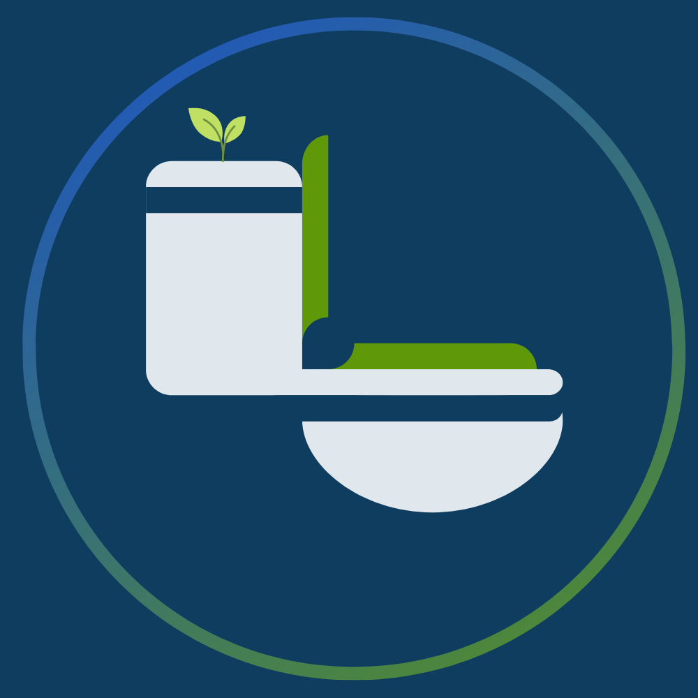

  # Nature's Call, a NYC Bathroom Locator App
  Collaborators: Hannah Fearns, Robert Le, Khadijah Akter, Mohannad Awah

- [Website](https://naturescalls.me/)
<div align = "center">




📹 Demo video [demo video](https://streamable.com/nmahe1)
</div>


## 🛠 Technologies Used

    and Vite.js

  
## ✨ Features & Achievements

- **Nearby Bathrooms Based on User's Location**: Integrated the powerful Google Places API to showcase nearby bathroom locations based on the user's device location (with permissions).
  

- **Comprehensive Bathroom Details**: Delivered a holistic view for users, offering filtering by amenities and star ratings and reviews.
  
  

- **Profile Page for Funsies**: Look at your created bathrooms and reviews! Also change your pfp!
  
  

- **User Authentication**: Implemented a robust authentication system leveraging bcrypt for secure password hashing and cookies for sessions, enabling users to create accounts and sign in securely.

- **Periodic Bathroom Updating**: Implemented Express.js's CronJob Feature for routinely bathroom updating.

- **Directions/ETA, and Bathroom Markers**: Implemented with React's Google package.

- **Bathroom ratings calculated from review ratings**: World-class rating calculations that automatically updates based on reviews.

  - Created a new 5 star review for the initial unrated bathroom, Jorge's Bathroom.
    
    It is initially 5 stars since the first review was 5 stars.
    
    It sucked so I added a second review, this time being 1 star, dropping this bathroom rating of a 5 to a 4.
    


## 🔧 Getting Started

1. First, clone the repository by running the following commands:
    ```bash
    git init
    git clone https://github.com/Hackerdude374/Natures-Call.git
    ```

2. Navigate to the main branch:
    ```bash
    git checkout main
    ```

3. Ensure you are on the correct branch (it should output main):
    ```bash
    git branch
    ```

4. Setting up the Backend:
    - Navigate to the server-side directory:
        ```bash
        cd Natures-Call/server-side
        ```
    - Install all required packages:
        ```bash
        npm i --force
        ```
    - Create an .ENV file to connect to the database:
        - NOTE: Please contact us to authenticate you and provide you the details for the fields in this file.
            ```plaintext
            DB_USER=
            DB_HOST=
            DB_NAME=
            DB_PASSWORD=
            DB_PORT=
            SESSION_SECRET=
            API_KEY=
            ```

5. After that, simply run this to start the backend express server:
    ```bash
    npm start
    ```

6. Now you should be done with backend, Lets set up the Frontend:
    - Navigate to the frontend directory:
        ```bash
        cd Natures-call/server-side/client
        ```
    - Install all required packages:
        ```bash
        npm i --force
        ```
    - Start the website:
        ```bash
        npm run dev
        ```

7. Create a .env file in this format (NOTE: Please contact us for a Google Maps/Places API key, or you can purchase one yourself):
    ```plaintext
    VITE_GOOGLE_MAPS_API_KEY=
    ```

## 📝 IMPORTANT DEVELOPER NOTE

- The "main" branch is not our latest changes. Our "presbackup" branch is our latest code, but the main branch had issues with deployment and other obstacles.
- If you would like to see our latest changes, follow the above steps, but checkout the "presbackup" branch.
- For frontend setup, use `cd Natures-Call/frontend/NaturesCall` and `npm run dev`.
- For backend setup, use `cd Natures-Call/server-side` and `npm start`.
- Enjoy!

## Cool Code Snippets/Explanations

### Periodically Updating Bathrooms with Cron Job

#### In server.js:

```javascript
// Our function to get bathrooms from external APIs.
const getAllBathrooms = async () => {
  let page = 1;
  const perPage = 10;

  while (true) {
    const options = {
      method: 'GET',
      url: 'https://public-bathrooms.p.rapidapi.com/location',
      params: {
        lat: '40.730610',
        lng: '-73.935242',
        page: page.toString(),
        per_page: perPage.toString(),
        offset: '0',
        ada: 'false',
        unisex: 'false'
      },
      headers: {
        'X-RapidAPI-Key': process.env.API_KEY, // The RapidAPI key we used (our third party bathroom data)
        'X-RapidAPI-Host': 'public-bathrooms.p.rapidapi.com'
      }
    };

    // Rest of the code...
};
```
Upserting our custom bathroom data fields within this third-party bathroom data:
 ```javascript
try {
  const [newBathroom, created] = await Bathroom.upsert({
    // Bathroom data fields...
  }, {
    returning: true,
    conflictFields: ["sourceid"]
  });
} catch (error) {
  // Error handling...
}
```

Scheduling it with cron for periodic updates:
```javascript
cron.schedule('0 0 1,15 * *', () => {
  getAllBathrooms();
});
```
